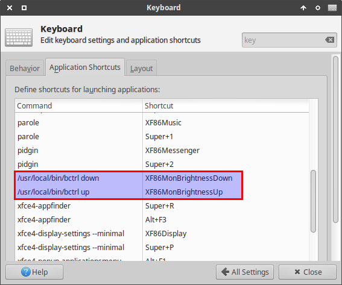

This is a simple script to control monitor brightness for Linux system.

How to install
==============

```bash
$ ./install.sh
```

How to use
==========

Increase the brightness with `up` and decrease with `down`.

```bash
$ bctrl [up|down]
```

A use case
==========

When installed Xubuntu in Macbook Air (3,2), the brightness control function is
broken. This script can help someone to enable this by add short cut in
keyboard setting as follows.


